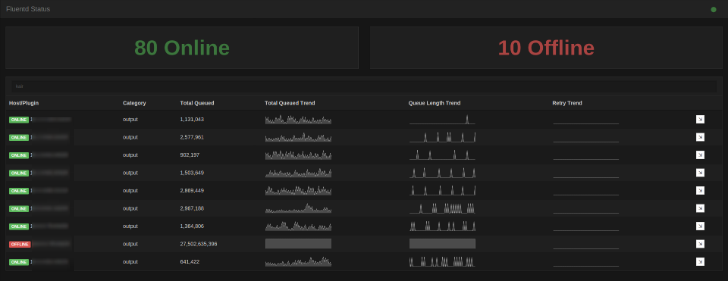

Fluentd Plugin Monitor
========================

UI for fluentd plugin monitoring API (http://docs.fluentd.org/articles/monitoring#monitoring-agent).



### Running

The deployed config file will be located in `/etc/fluentd-monitor/`. This should
be updated with the target fluentd hosts.

Once the config is updated `service fluentd-monitor start` and check localhost:8080 on the host.

### Deploying

Distributable packages (RPM etc.) can be built using `make package PACKAGE_TYPE=rpm`. Packaging requires the effing
package manager. Supported package types can be found in the FPM docs. Alternatively use one of the packages in
the dist directory.

Installing from source is possible using `make install`.

#### Nginx Proxy

If you wish to proxy this application with nginx (e.g. to add authentication) some special configuration is required
to allow the web-sockets to work correctly.

Sample location block:

```
location / {
    proxy_pass http://127.0.0.1:8080;
    proxy_buffering off;
    proxy_http_version 1.1;
    proxy_set_header Upgrade $http_upgrade;
    proxy_set_header Connection "upgrade";
}

```

### Developing

Requires:
- bower
- npm
- grunt-cli
- esc (http://godoc.org/github.com/mjibson/esc)

The front end files are by default embedded in static.go. They can be updated and rebuilt
by doing the following:

1. Checkout npm/bower sources `cd ui && npm install && bower install`
2. Rebuild dist assets from sources `grunt`
3. Rebuild embedded files (from project root) `make static`

During development it is possible to serve raw files from the ui/static directory by setting
an environment variable:

    DEV=true go run *.go
